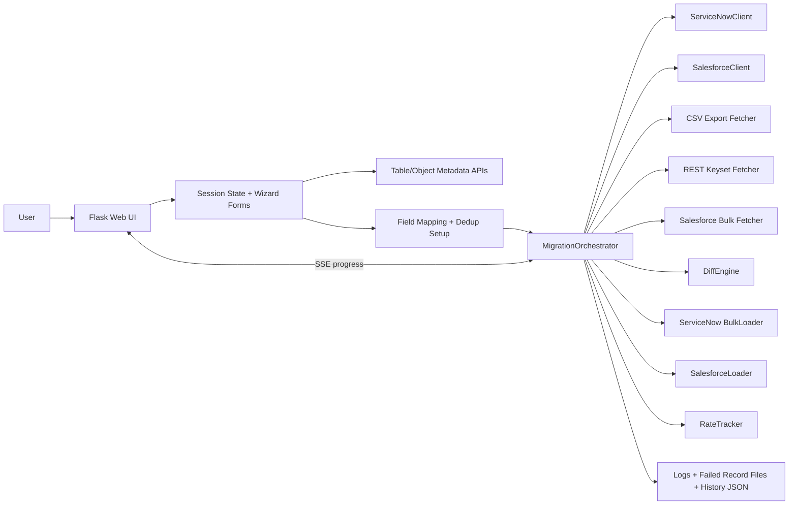

# Product Requirements Document

## Executive Summary

SNSF is a Flask-based migration workbench for moving records between ServiceNow and Salesforce in any source/target combination: ServiceNow to ServiceNow, ServiceNow to Salesforce, Salesforce to Salesforce, and Salesforce to ServiceNow. The product’s main value is a guided migration flow that discovers tables or objects, maps fields, resolves cross-instance references or deduplication keys, runs a high-volume fetch/diff/load pipeline, and records migration history for operational review.

The implementation is optimized for large datasets and low operator overhead. It uses keyset pagination, ServiceNow CSV export streaming, Salesforce Bulk API 2.0, batched write paths, and a live SSE progress channel so the UI can stay responsive while migrations run in the background.

## System Architecture

## Data Flow

### Input Sources

The system accepts credentials, migration type, source/target tables or objects, field mappings, and an optional fetch strategy choice.

### Processing Pipeline

1. The operator selects a migration type in the home page.
2. The connection form captures source and target credentials and validates them against the selected platforms.
3. The table/object picker searches ServiceNow tables or Salesforce objects through API-backed autocomplete.
4. The field-mapping screen fetches metadata for both sides, auto-matches exact field names, lets the user manually map the rest, and configures deduplication via a ServiceNow legacy sys_id field or Salesforce external ID field.
5. The migration starts in a background thread.
6. `MigrationOrchestrator` fetches source data, resolves references when needed, fetches target records, computes the diff, and loads inserts and updates using the fastest available write path.
7. Progress and errors are streamed to the browser using Server-Sent Events.
8. Final results are written to migration history, log files, and optional failed-record JSON files.

### Output Destinations

The system writes results to the browser UI, `data/migration_history.json`, rotating logs under `logs/`, API audit logs, and `logs/failed_records_*.json` for failed payloads.

## Workflow

### User Workflow

1. Choose one of four migration directions.
2. Connect to source and target systems.
3. Search for source and target tables or objects.
4. Map fields and confirm deduplication settings.
5. Start the migration and monitor progress in real time.
6. Review the final report and historical runs.

### System Workflow

1. Validate and cache session credentials.
2. Resolve metadata for source and target schemas.
3. Fetch source records using the best available strategy for the platform.
4. Fetch target records for matching and diffing.
5. Build insert/update/skip sets.
6. Load records using the best available write strategy for the platform.
7. Emit a final migration report and store the result.

### External Dependencies

The app depends on ServiceNow REST APIs, ServiceNow CSV export endpoints, Salesforce SOAP or OAuth login, Salesforce REST Describe/Query APIs, Salesforce Bulk API 2.0, Salesforce SObject Collections, Flask, Requests, and python-dotenv for environment loading.

## Component Descriptions

### `app.py`

Flask entry point and wizard controller. It owns the routes, session persistence, SSE stream, background thread kickoff, and history storage.

### `config.py`

Environment-driven configuration and logging bootstrap. It defines credentials, tuning knobs, file locations, and rotating log setup.

### `migration/client.py`

ServiceNow client with retry handling, keyset pagination, CSV export streaming, batch requests, and schema helpers.

### `migration/sf_client.py`

Salesforce client with SOAP or OAuth authentication, object and field discovery, SOQL query support, Bulk API 2.0, and SObject Collections support.

### `migration/migrator.py`

Top-level orchestrator that coordinates source fetch, target fetch, diffing, loading, failed-record capture, timing, and final reporting.

### `migration/fetcher.py`

REST keyset fetcher for ServiceNow tables.

### `migration/csv_fetcher.py`

High-volume ServiceNow CSV export fetcher, including serial keyset mode and parallel partition mode.

### `migration/sf_bulk_fetcher.py`

Salesforce Bulk API 2.0 query fetcher with REST fallback.

### `migration/differ.py`

Set-based diff engine that classifies source records as inserts, updates, or skips.

### `migration/loader.py`

ServiceNow bulk loader with JSONv2, batch API, and parallel REST fallback strategies.

### `migration/sf_loader.py`

Salesforce loader with Bulk API 2.0 ingest, SObject Collections, and single-record fallback.

### `migration/rate_tracker.py`

Tracks ServiceNow and Salesforce API usage, parses rate headers, and emits audit logs.

### Templates, CSS, and JS

The templates implement the wizard UI, the CSS defines the glassmorphism-style presentation, and the JavaScript provides live table search, field filtering, mapping behavior, and form submission guards.

## Technology Justification

### Flask

Chosen for a lightweight, server-rendered workflow with simple session handling, background job kickoff, and SSE support.

### Requests

Used for direct HTTP control, retries, streaming responses, and vendor-specific API flows.

### python-dotenv

Retained because configuration is loaded from `.env` files in development and local deployments.

### urllib3 Retry

Used through Requests adapters for resilient API calls and automatic retry backoff.

### Salesforce Bulk API 2.0

Used for high-volume query and ingest paths where REST would be too slow or too chatty.

### ServiceNow CSV Export Processor

Used to bypass the standard REST page limits for large ServiceNow tables.

## Cleaned Dependency List

### Keep

`flask>=3.0`, `requests>=2.31`, `python-dotenv>=1.0`, `urllib3>=2.0`

### Remove

`faker>=25.0` is unused in the codebase and can be removed from `requirements.txt`.

### Notes

`python-dotenv` is used by `config.py`, so it should remain. `urllib3` is imported directly for retry handling, so it is also justified.

## Implementation Notes

The migration pipeline uses background threads and a shared progress queue, so the UI should be treated as single-session oriented rather than multi-tenant. Target deduplication differs by platform: ServiceNow can use a legacy sys_id field, while Salesforce uses an external ID field.

Large migrations may generate failed-record files and log output, so log rotation and disk space monitoring matter. The code also supports auto-fallbacks when CSV export, Bulk API, or batch endpoints are unavailable.

## Edge Cases

Source or target authentication may succeed but metadata calls can still fail if object ACLs or permissions are incomplete. CSV export can return malformed or truncated rows, so the parser defensively filters invalid data. Salesforce describe metadata may include read-only or compound fields, which the UI filters before mapping.

Reference-field remapping is approximate when display values differ across instances, and coalesce/external-ID dedup only works when the target schema already has the matching field or can create it. The app is also designed around one active migration at a time because it uses a single shared progress queue.
