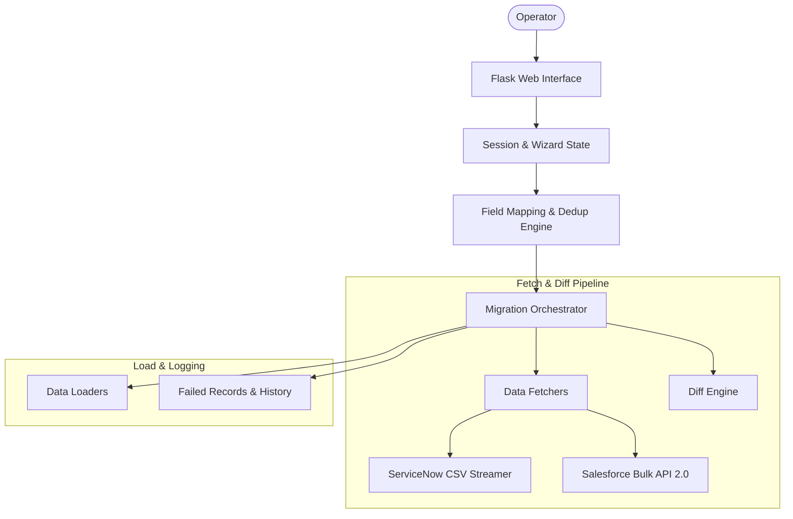

# 🚀 MigrateNow (SNSF)

MigrateNow is a powerful, lightweight, and visual migration workbench designed to transfer records between **ServiceNow** and **Salesforce** instances in any combination. Whether you are moving data within the same platform or cross-platform, MigrateNow provides a simple, wizard-like interface to map fields, handle deduplication, and execute high-performance migrations.

---

## ✨ Key Features

- **🔄 Multi-Directional Migration:**
  - ServiceNow ➡️ ServiceNow
  - ServiceNow ➡️ Salesforce
  - Salesforce ➡️ Salesforce
  - Salesforce ➡️ ServiceNow
- **⚡ High-Performance Architecture:** Uses ServiceNow CSV streaming, Salesforce Bulk API 2.0, and keyset pagination to handle massive datasets with low memory usage.
- **🎨 Interactive Field Mapping:** Auto-matches fields with identical names, enables manual mapping for others, and configures smart deduplication rules.
- **⏳ Real-Time Monitoring:** Live progress tracking with Server-Sent Events (SSE) including record rates, elapsed time, and dynamic logs.
- **🛡️ Built-in Resilience:** Automatic API rate-limit tracking, request retries with backoff, and robust error logging (with exportable failed-record files).

---

## 🏗️ System Architecture & Data Flow



### 🔁 How a Migration Works (Step-by-Step)
1. **Choose Direction:** Select your source and target platforms.
2. **Connect:** Enter credentials for both platforms (validated securely).
3. **Select Tables/Objects:** Search and pick source and target schemas.
4. **Map Fields & Dedup:** Pair fields together and define a deduplication key (e.g., `sys_id` or `External ID`).
5. **Migrate:** Start the migration and watch live progress updates on the dashboard.
6. **Review:** Check results, logs, and any failed records for complete auditability.

---

## 🛠️ Technology Stack

- **Backend:** Flask (Python 3) for lightweight routing, session management, and Server-Sent Events (SSE).
- **Frontend:** Vanilla HTML, CSS (Modern dark mode with Glassmorphism effects), and vanilla JavaScript.
- **APIs:** `requests` & `urllib3` with robust retry handling, ServiceNow REST & CSV export, Salesforce SOAP/OAuth, and Salesforce Bulk API 2.0.

---

## 🚀 Quick Start & Installation

### 1. Prerequisites
- **Python 3.8+** installed on your system.

### 2. Install Dependencies
```bash
pip install -r requirements.txt
```

### 3. Setup Environment
Create a `.env` file in the root directory:
```env
# Optional environment overrides
FLASK_ENV=development
PORT=5000
```

### 4. Run the Application
```bash
python app.py
```
Open [http://localhost:5000](http://localhost:5000) in your browser!

---

## 📂 Project Structure

```text
├── app.py                  # Flask application entry point & wizard controller
├── config.py               # Environment & rotating log configuration
├── requirements.txt        # Project dependencies (Flask, requests, python-dotenv, urllib3)
├── migration/
│   ├── client.py           # ServiceNow API Client
│   ├── sf_client.py        # Salesforce API Client
│   ├── migrator.py         # Top-level Migration Orchestrator
│   ├── fetcher.py          # Keyset and Bulk Fetchers
│   ├── differ.py           # Set-based Diffing Engine
│   ├── loader.py           # ServiceNow & Salesforce Bulk Loaders
│   └── rate_tracker.py     # API Rate Limit & Header Tracker
├── templates/              # HTML layout and step-by-step wizard forms
└── static/                 # Glassmorphic CSS style sheets & frontend JS
```

---

## 📝 License
This project is proprietary. All rights reserved.
