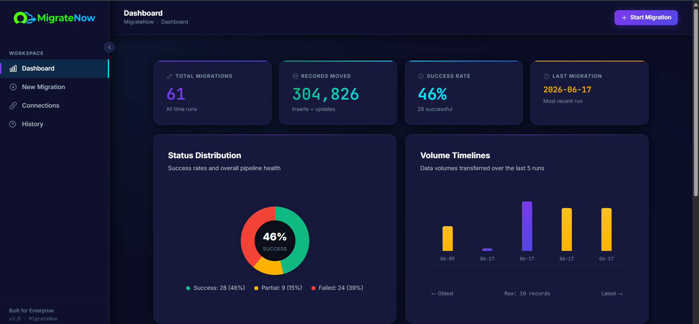
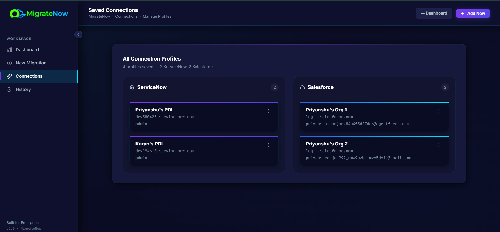
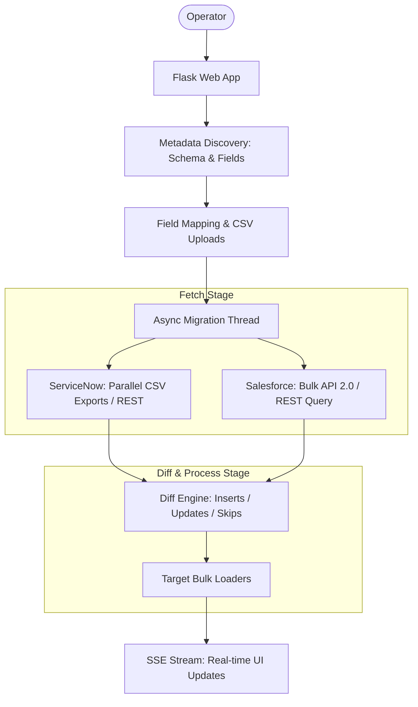

# MigrateNow — Enterprise Data Migration Workbench

<p align="center">
  
</p>

MigrateNow is a robust, intuitive web-based workbench designed for high-volume data migrations between **ServiceNow** and **Salesforce**. Built with a Python/Flask backend and a modern glassmorphic frontend, it simplifies cross-platform schema translation, field mapping, and bulk data load operations into a seamless, guided workflow.

---

## 📸 Screenshots

*(Add your screenshots below to make the repository more appealing)*

### Dashboard
<p align="center">
  
</p>

### Saved Connections
<p align="center">
  
</p>

### Field Mapping
<p align="center">
  
</p>

---

## ⚡ Key Features

- **Multi-Directional**: Seamless data transfer across all four ServiceNow and Salesforce vectors.
- **Auto-Discovery & Mapping**: On-the-fly schema detection, visual UI mapping, and CSV mapping uploads.
- **Smart Diffing**: Automatically detects inserts, updates, and skips while ignoring read-only system fields.
- **Async Execution**: Non-blocking background worker threads handle massive bulk loads.
- **Live Tracking**: Real-time progress and count streams to the UI via Server-Sent Events (SSE).

---

## 🏗️ High-Level Architecture (HLD)

MigrateNow is designed to be highly performant, utilizing parallel operations and bulk endpoints to handle large datasets efficiently.



---

## 🛠️ Tech Stack & Integrations

### Core Technologies
- **Backend**: Python 3, Flask, Multi-threading
- **Frontend**: HTML5, Vanilla JavaScript, CSS (Premium Glassmorphism UI)
- **Real-time Comms**: Server-Sent Events (SSE)

### API Integrations
- **ServiceNow**: 
  - **Discovery**: `sys_db_object` & `sys_dictionary`
  - **Reads**: Parallel Partitioned CSV Exports (`/?CSV`) or Keyset-Paginated REST
  - **Writes**: JSONv2 `insertMultiple` and Table API
- **Salesforce**:
  - **Discovery**: Standard REST `/describe` endpoints
  - **Reads**: Bulk API 2.0 Query jobs
  - **Writes**: Bulk API 2.0 Ingest jobs and SObject Collections

---

## 🚀 Getting Started

### 1. Prerequisites
- **Python 3.8+** installed on your system.

### 2. Install Dependencies
```bash
pip install -r requirements.txt
```

### 3. Configure Environments
Create a `.env` file in the root directory:
```env
FLASK_SECRET=your-premium-session-secret-key
FLASK_PORT=5000
LOG_LEVEL=INFO
```

### 4. Run the Workbench
Launch the development server:
```bash
python app.py
```
Open [http://localhost:5000](http://localhost:5000) in your browser!

---

## 📝 License

This project is proprietary. All rights reserved.
