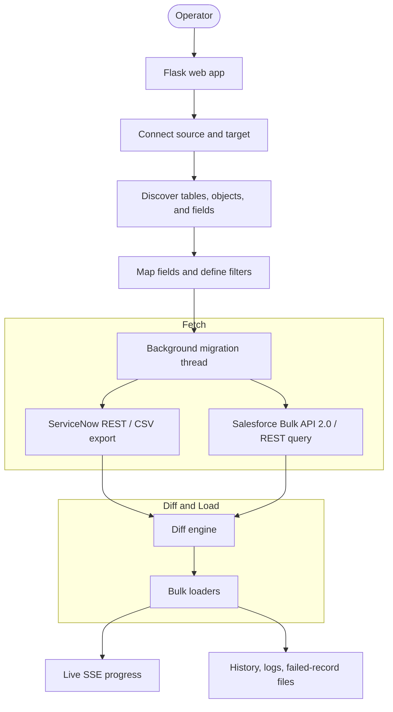

# SNSF

SNSF is a Flask-based migration workbench for moving records between ServiceNow and Salesforce. It supports all four directions: ServiceNow to ServiceNow, ServiceNow to Salesforce, Salesforce to Salesforce, and Salesforce to ServiceNow.

The app follows a guided flow: connect to both systems, discover tables or objects, fetch field metadata, map fields, apply filters, run the migration in the background, and stream live progress back to the browser.

## What the app does

- Finds ServiceNow tables and Salesforce objects through API-backed search
- Pulls field metadata from both platforms before mapping
- Auto-matches fields with the same name and lets the user map the rest manually
- Lets the user define record filters before the fetch starts
- Runs the migration in the background so the UI stays responsive
- Saves migration history, logs, and failed records for review

## Current stack

- **Language:** Python 3
- **Backend framework:** Flask
- **Frontend:** HTML, CSS, and JavaScript
- **HTTP and retry layer:** requests with urllib3 Retry
- **Real-time updates:** Server-Sent Events (SSE)
- **Concurrency model:** one background thread per migration, plus parallel fetch/load strategies where the platform allows it
- **Persistence:** JSON files under data/ and rotating logs under logs/
- **ServiceNow APIs:** sys_db_object, sys_dictionary, Table API, stats API, CSV Export Processor, JSONv2, and Batch API
- **Salesforce APIs:** SOAP Partner login, OAuth username-password login, /sobjects, /describe, /query, Bulk API 2.0 query/ingest, and SObject Collections

## Main flow



## End-to-end migration steps

1. The user chooses a migration type on the home page.
2. The app stores the migration direction and shows the connect screen.
3. The user enters source and target credentials.
4. ServiceNow connections use basic auth against the instance host.
5. Salesforce connections use either SOAP Partner login or OAuth username-password login.
6. The app searches for source and target tables or objects through API calls.
7. ServiceNow table search uses `sys_db_object` with `nameLIKE` and `labelLIKE` filters.
8. Salesforce object search uses the `/sobjects/` list and filters it client-side.
9. The app fetches field metadata before mapping.
10. ServiceNow field metadata comes from `sys_dictionary`, including inherited fields from parent tables.
11. Salesforce field metadata comes from `/sobjects/{object}/describe`.
12. The field-mapping screen auto-matches exact field names and lets the user manually map the rest.
13. The user can also add record filters.
14. ServiceNow filters are converted into encoded queries and sent as `sysparm_query`.
15. Salesforce filters are converted into SOQL `WHERE` clauses.
16. The app can also fetch autocomplete values for filter inputs through `/api/autocomplete_values`.
17. When the user starts the migration, Flask launches a background thread so the web request returns immediately.
18. The UI listens to `/migrate/stream` over SSE to receive live progress events.
19. Source records are fetched using the best available strategy for the platform.
20. ServiceNow first tries the CSV Export Processor endpoint, then falls back to keyset-paginated REST if needed.
21. Salesforce first tries Bulk API 2.0 query jobs, then falls back to REST `/query` pagination.
22. ServiceNow CSV fetches can run in parallel partitions for larger tables.
23. ServiceNow REST fetches use `sys_id` keyset pagination, not offset paging.
24. Salesforce REST fetches follow `nextRecordsUrl` until the full dataset is read.
25. If reference fields need cross-instance translation, the orchestrator resolves them before diffing.
26. Target records are fetched next so the app can decide whether each source record is an insert, update, or skip.
27. The diff engine ignores system fields that always change across instances.
28. Matching is done by `sys_id` for ServiceNow or `Id` for Salesforce.
29. If the target uses a Salesforce external ID, the app can coalesce on `SN_Legacy_Id__c`.
30. Insert and update records are then sent through the fastest loader available.
31. ServiceNow inserts prefer parallel JSONv2 `insertMultiple`, then Batch API, then single-record Table API fallback.
32. ServiceNow updates prefer Batch API, then parallel PATCH fallback.
33. Salesforce inserts prefer Bulk API 2.0 ingest, then SObject Collections, then single-record REST fallback.
34. Salesforce updates prefer Bulk API 2.0 upsert when an external ID is available, then SObject Collections, then single-record PATCH fallback.
35. The rate tracker records API usage and rate-limit headers during the run.
36. Final results are written to migration history, log files, and failed-record JSON files.

## API map

- **ServiceNow table discovery:** `/api/now/table/sys_db_object`
- **ServiceNow field discovery:** `/api/now/table/sys_dictionary`
- **ServiceNow record fetch:** `/api/now/table/{table}` with `sysparm_query`
- **ServiceNow counts:** `/api/now/stats/{table}`
- **ServiceNow CSV export:** `/{table}_list.do?CSV`
- **ServiceNow bulk write:** JSONv2 `insertMultiple`, `/api/now/batch`, and Table API POST/PATCH
- **Salesforce object discovery:** `/services/data/vXX.X/sobjects/`
- **Salesforce field discovery:** `/services/data/vXX.X/sobjects/{object}/describe/`
- **Salesforce record fetch:** `/services/data/vXX.X/query/` and Bulk API 2.0 query jobs
- **Salesforce bulk write:** Bulk API 2.0 ingest jobs and SObject Collections
- **Live progress:** `/migrate/stream`
- **Search helpers:** `/api/search_tables`, `/api/search_objects`, and `/api/autocomplete_values`

---

## 🚀 Quick Start & Installation

### 1. Prerequisites

- **Python 3.8+** installed on your system.

### 2. Install Dependencies

```bash
pip install -r requirements.txt
```

### 3. Setup Environment

Create a `.env` file in the root directory:

```env
# Optional environment overrides
FLASK_ENV=development
PORT=5000
```

### 4. Run the Application

```bash
python app.py
```

Open [http://localhost:5000](http://localhost:5000) in your browser!

---

## 📂 Project Structure

```text
├── app.py                  # Flask application entry point & wizard controller
├── config.py               # Environment & rotating log configuration
├── requirements.txt        # Project dependencies (Flask, requests, python-dotenv, urllib3)
├── migration/
│   ├── client.py           # ServiceNow API Client
│   ├── sf_client.py        # Salesforce API Client
│   ├── migrator.py         # Top-level Migration Orchestrator
│   ├── fetcher.py          # ServiceNow keyset fetcher
│   ├── csv_fetcher.py      # ServiceNow CSV export fetcher
│   ├── sf_bulk_fetcher.py  # Salesforce Bulk API 2.0 query fetcher
│   ├── differ.py           # Set-based Diffing Engine
│   ├── loader.py           # ServiceNow bulk loader
│   ├── sf_loader.py        # Salesforce bulk loader
│   └── rate_tracker.py     # API Rate Limit & Header Tracker
├── templates/              # HTML layout and step-by-step wizard forms
└── static/                 # Glassmorphic CSS style sheets & frontend JS
```

---

## 📝 License

This project is proprietary. All rights reserved.
